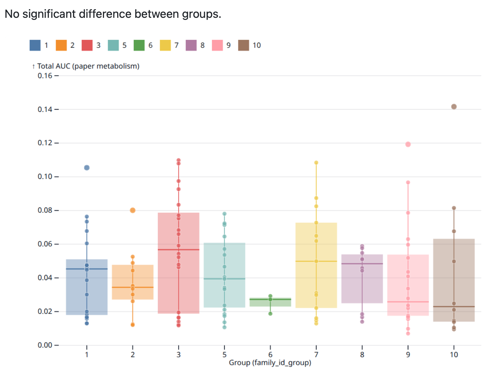
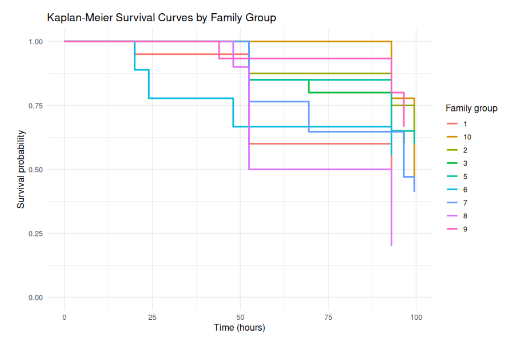
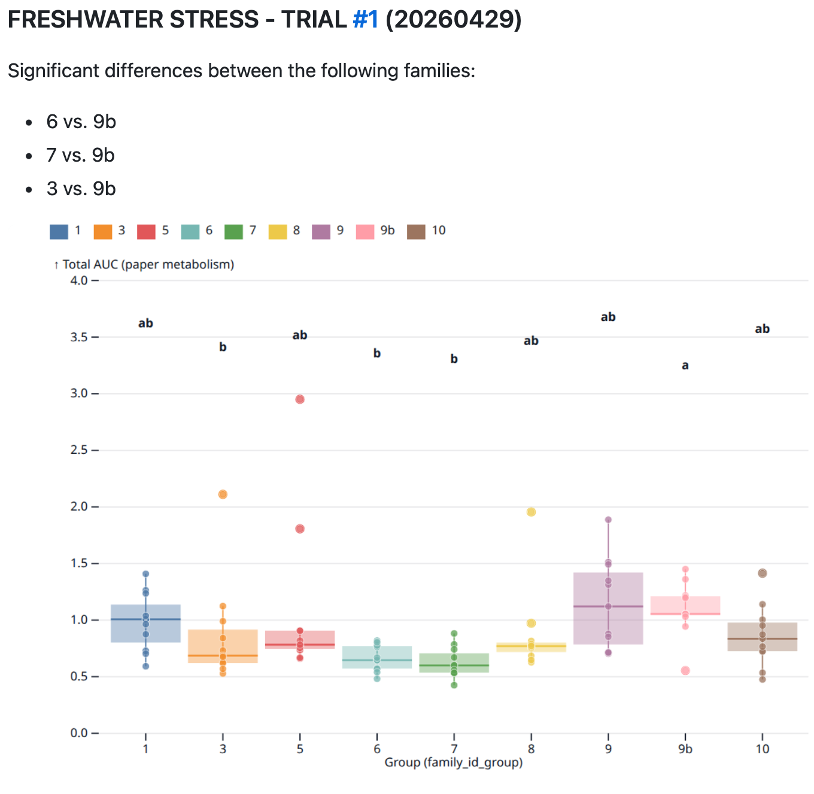
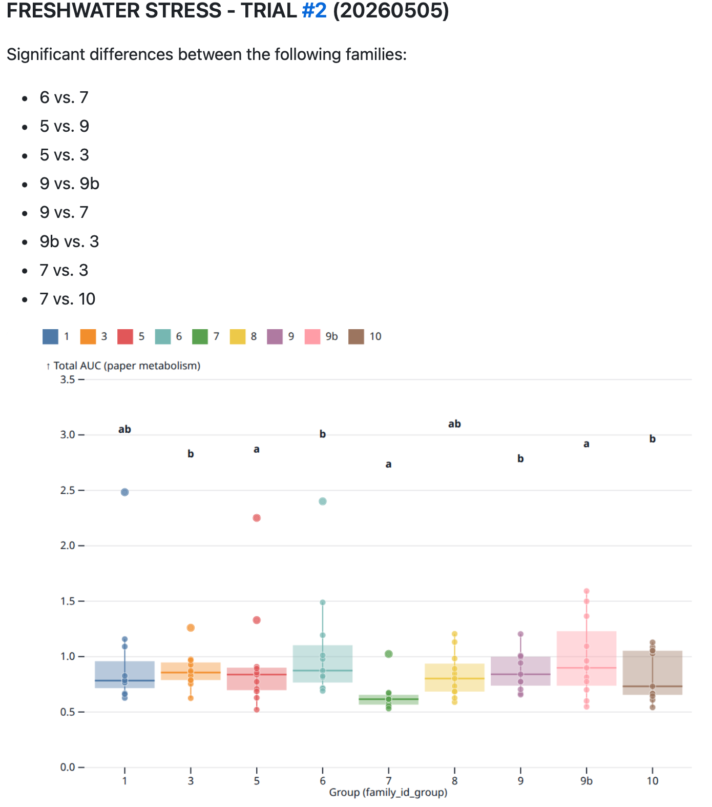
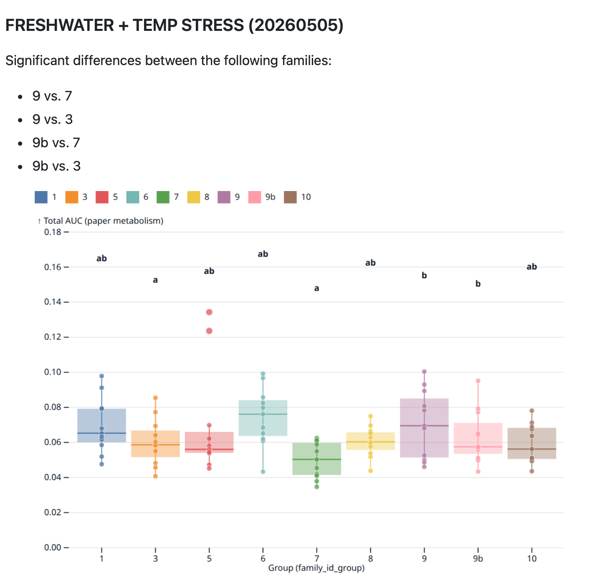

Over the past month we have ran some initial SORMI assays on the USDA YC25 families.

In short there was one adult-cup resazurin, a follow up [heat-mortality test (33C)](https://github.com/RobertsLab/sormi-assay-development/tree/main/heat-survivorship/20260427-33C-USDA-families), two FW RT resazurin plate-runs, and one FW 36C resazurin plate. I would not trust the stats.

# Resazurin

Run in solo cups in incubator.

# Mortality

# Resazurin (12-well)

Smaller oysters run in 12-well plates. Used FW for making up resazurin. Room temperature.

Then the did a run with 36

