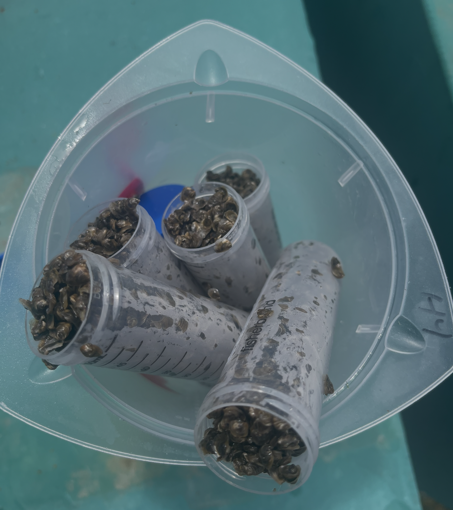
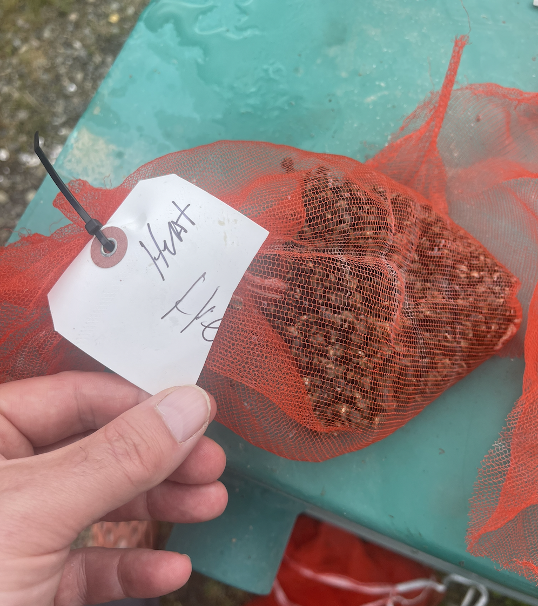

On February 26 received 10k 4mm seed from Jamestown.

Took 150 ml and bagged with heat label - and 150 ml bagged and labelled with control. Both went into outside drum silos.

The remaining oyster brought back to UW.

Heat priming will start next week- with plan on weekly at 12C for 30 minutes.
