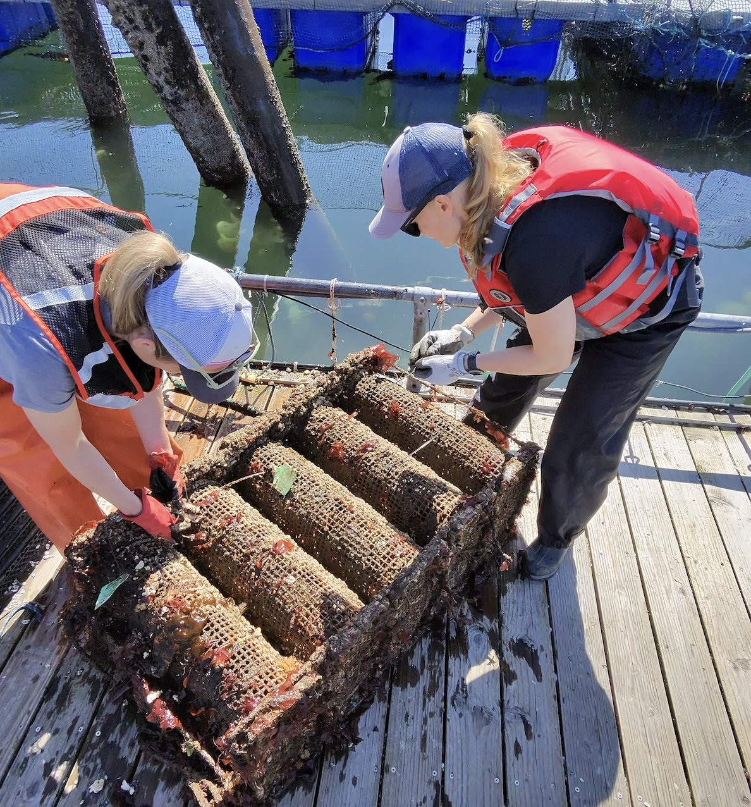
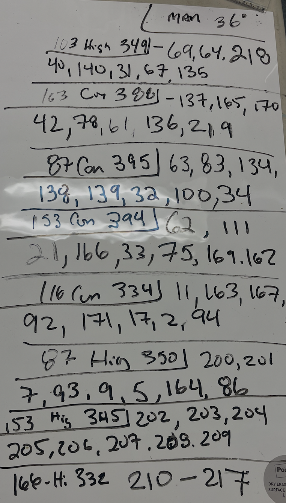
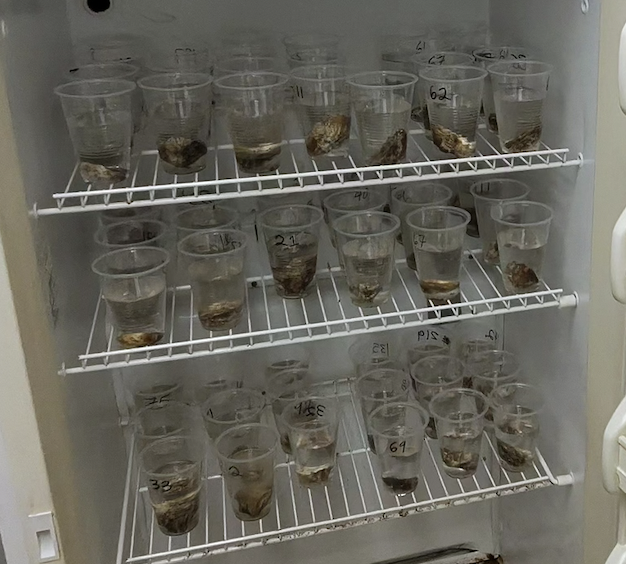

Last week we pulled some oysters from Manchester that had different priming experiences.

There were 8 cohorts and 8 oysters were brought back to UW. \
\
:[Spreadsheet](https://docs.google.com/spreadsheets/d/1suyutJjz5jdJ-H3tTnz6piezhtyCK2XbPEnfmU2bEMo/edit?usp=sharing): with cup IDs and Tag \#

Placed in incubator in 16 oz cups with instant ocean at 10am on Monday (Day 01). At 4pm Monday there was 1 mortality.

.
