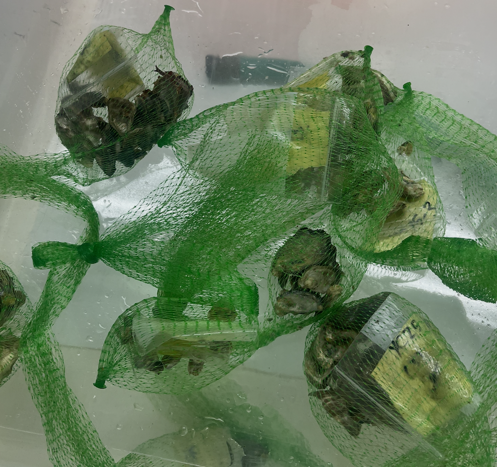
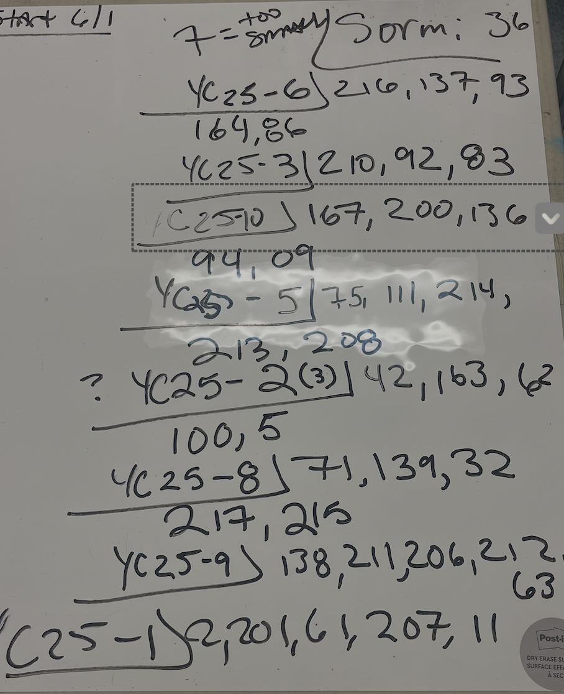

From one of the first transport of SORMI oysters from Manchester, there were leftover adults that have been hanging out in tanks.. For context these are leftovers of when we did the BIG resazurin trial where solution was made in 5 gallon bucket!

\
\
Took 5 oyster from each family, added to cup and and filled to first ridge (about 2cm) with instant ocean. Incubator set at 35C (NOTE 36 on whiteboard was revised after photo). Went in at 4pm June 3.

