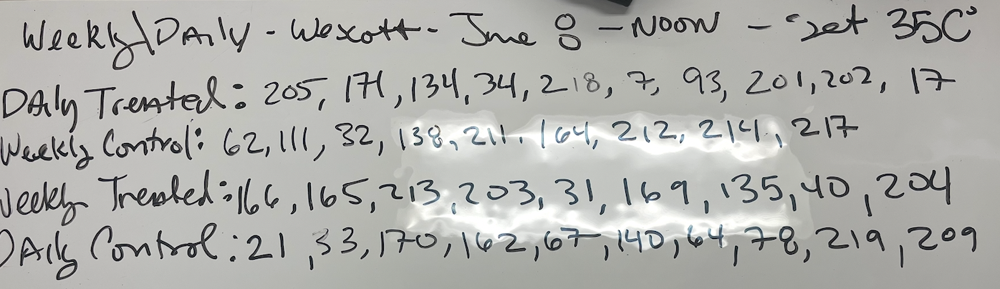

We had some leftover oyster from Wescott Bay Weekly and Daily primed.

Started Mortality Trial at Noon on June 8. 35C

Mort Reading June 8 at 4pm 3 dead.

June 9 9am - several dead.

June 9 at 9:30 am seemed to blow fuse. 

At 3pm temperature down to 30C with only 1 dead at that time

Leaving overnight. 

