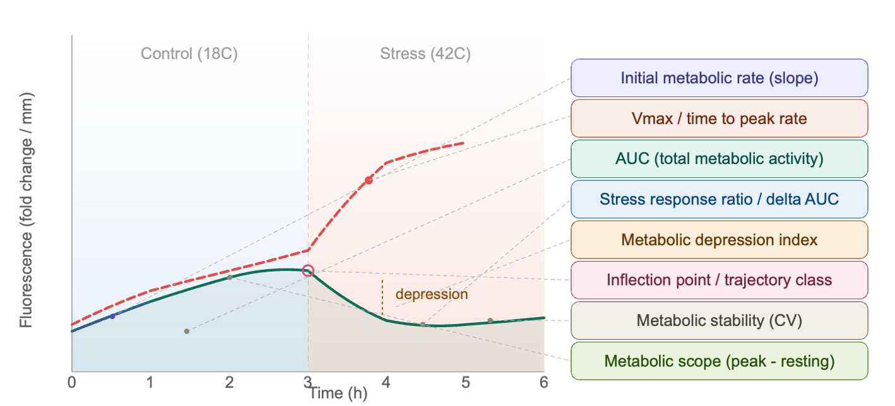

Based on the combined examination of resazurin results to date, the best experiment design should optimize for **dynamic curve-shape metrics**, not just endpoint fluorescence. **A full notebook post is upcoming**

The strongest recurring family-separating metrics were:

-   **Early response/capacity:** `auc_early`, `initial_slope`, `auc_total`

-   **Depression/stress trajectory:** `delta_auc_late_minus_early`, `min_slope`, `metabolic_depression_index`, `depression_abs`

-   **Endpoint/scope metrics:** `final_delta`, `metabolic_scope`, `peak_value`

-   **Timing metrics:** `time_to_vmax`, `inflection_time`

But one big caution: `trough_value` dominates several older experiments. That may be biologically real, but it can also reflect **plate/family confounding or baseline/blank-correction structure**, especially if families were grouped by plate. I would not design future experiments around trough alone.

**Recommended Experiment Design**

Run future assays with enough time resolution to estimate both early activation and late depression:

-   **T0**

-   **0.5 h**

-   **1 h**

-   **1.5 h**

-   **2 h**

-   **3 h**

-   **4 h**

-   Optional: **6 h** if testing freshwater or slower RT responses

-   Optional: **24 h+** only if the goal is long-term metabolic depression/recovery

For heat-stress experiments, the most useful window appears to be **0-4 h**, with dense early sampling. The `20260624-mgig-33C` experiment only had 0, 1, 2, 3 h and produced weak family separation, so I would extend that to at least 4 h and add 0.5/1.5 h.

**Best Conditions To Prioritize**

I’d prioritize:

1.  **36C heat stress, 0-4 h, dense early sampling**

    -   Good for `initial_slope`, `time_to_vmax`, `inflection_time`, `metabolic_scope`, `delta_auc_late_minus_early`.

2.  **Freshwater/heat stress, 0-32 h or 0-48 h**

    -   Stronger family signals in existing data, especially AUC and depression/recovery metrics.

3.  **Avoid relying on 33C short-duration assays alone**

    -   The 20260624 33C run had the weakest separation; useful, but not ideal as the main discriminating assay.

**Most Important Design Fix**

Randomize families across plates, wells, and rounds.

Do not put one family mostly on one plate. The best metrics should distinguish family biology, not plate effects. Ideally:

-   Each plate contains multiple families.

-   Each family appears on multiple plates.

-   Blanks are included on every plate.

-   Round is balanced across families.

-   Use the same timepoints for all plates/rounds.

-   Keep oyster size measurements; use `metabolism_per_area_mm2_measurement` as the primary normalized metric.

**Replication**

Aim for at least:

-   **10-12 oysters per family per condition**

-   Preferably spread across **2-3 rounds**

-   Each family represented in each round

The signal improved when experiments had enough individuals and enough timepoints to estimate curve shape.

**Practical Recommendation**

For the next family-comparison assay, I’d run:

`36C heat stress, sampled at 0, 0.5, 1, 1.5, 2, 3, 4 h`

Primary metrics to evaluate:

-   `initial_slope`

-   `auc_early`

-   `vmax`

-   `time_to_vmax`

-   `metabolic_scope`

-   `delta_auc_late_minus_early`

-   `min_slope`

-   `metabolic_depression_index`

-   `stability_cv`

Then, if freshwater stress is biologically central, run a second longer assay:

`freshwater stress, sampled at 0, 1, 2, 4, 8, 24, 32 or 48 h`

That one should emphasize AUC, late/early AUC ratio, final delta, and depression/recovery metrics.
