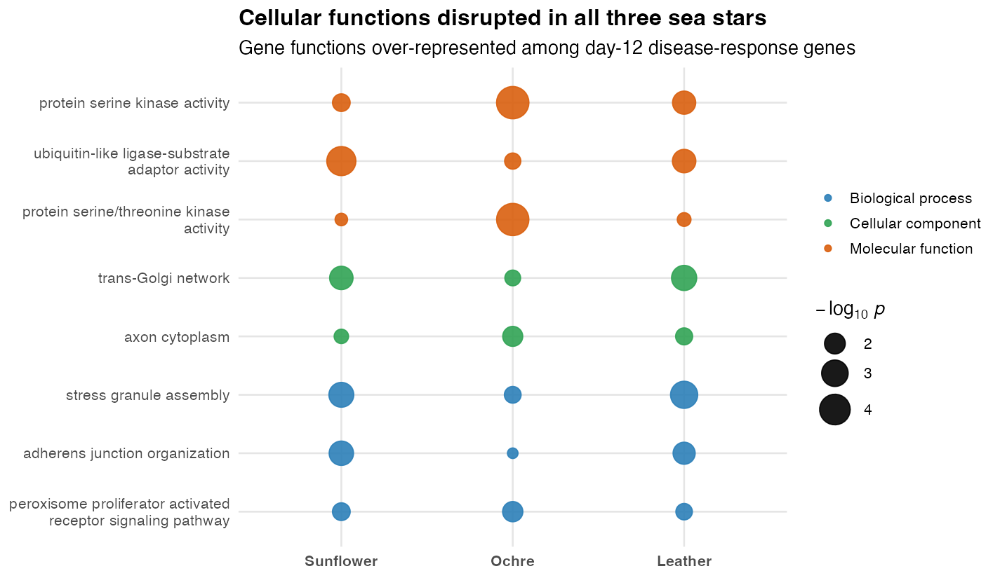
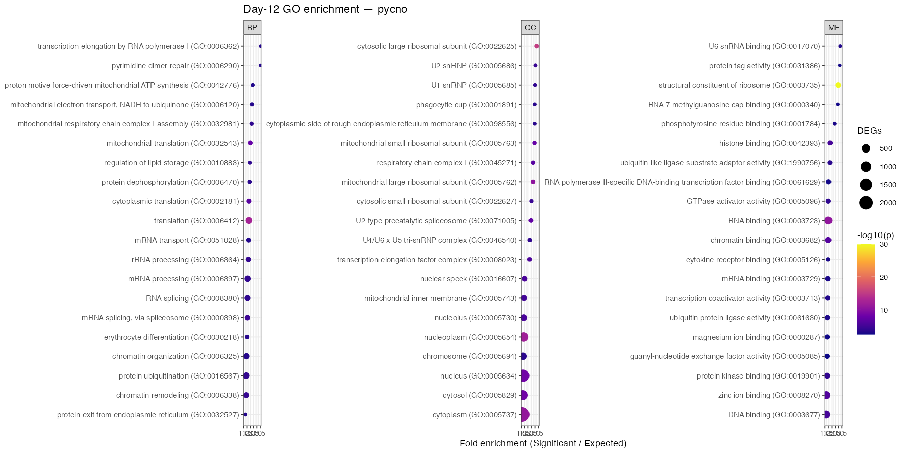
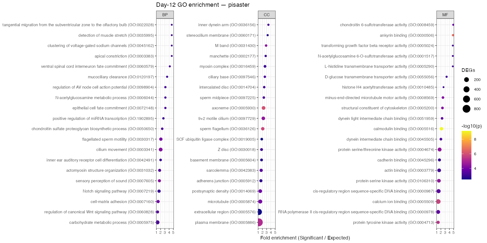
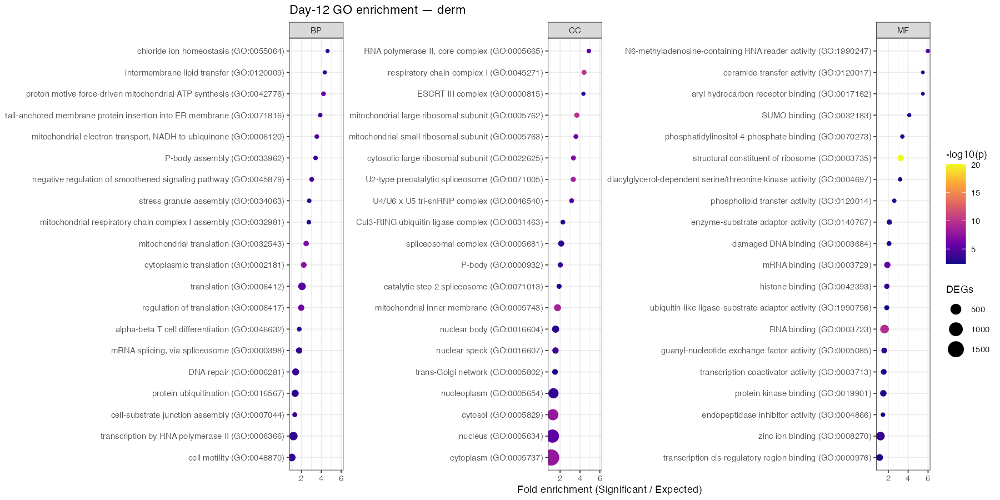

## The short version

Sea star wasting disease has wiped out huge numbers of sea stars along the Pacific coast over the last decade. The sunflower star was hit so hard it is now considered critically endangered. We have been trying to understand what is happening *inside* the animals as they get sick — and whether different kinds of sea stars fall ill in the same way.

This post walks through a small piece of that: I took the genes that change when three sea star species are exposed to the disease and asked a simple question — **what jobs do those genes do, and do the three species share the same response?**

## What we were looking at

When a cell is under stress, it turns some genes up and turns others down. By sequencing the RNA from healthy animals and disease-exposed animals, we can find the genes whose activity changes — the "differentially expressed genes," or DEGs. Here I used the day-12 DEGs from three species:

- **Sunflower star** (*Pycnopodia helianthoides*) — \~6,200 genes changed
- **Ochre star** (*Pisaster ochraceus*) — \~6,800 genes changed
- **Leather star** (*Dermasterias imbricata*) — \~3,400 genes changed

A long list of genes is hard to interpret on its own. So instead of reading it gene by gene, I grouped the genes by what they *do* — the biological jobs they are known to perform. Every gene comes with a set of standardized "Gene Ontology" labels (things like *stress response*, *protein recycling*, *cell-to- cell adhesion*). If a particular job shows up among the disease-response genes far more often than you'd expect by chance, that job is probably part of how the animal reacts to the disease. Statisticians call this **enrichment**; think of it as spotting which topics come up suspiciously often in a stack of documents.

One extra step matters here. To compare across three very different species, I only used genes that could be matched to a shared gene family (an "ortholog") across the animals — so I was comparing like with like, not one species' unique genes against another's.

## The headline: a small shared core

Each species had its own long list of over-represented functions — 448 in the sunflower star, 536 in the ochre star, and 348 in the leather star. Most of that was species-specific. But **eight functions were over-represented in all three species at once.** That shared core is the most interesting result, because a response common to three separate animals is more likely to be central to the disease itself rather than a quirk of one species.

These eight shared jobs sketch a coherent picture of cells in distress:

- **Stress granule assembly** — a classic emergency response where a cell hits pause on normal protein-making to ride out stress.
- **Protein kinase activity** (two related entries) — the cell's signaling switches, used to relay "something is wrong" messages.
- **Ubiquitin-ligase adaptor activity** — part of the machinery that tags damaged proteins for disposal.
- **trans-Golgi network** and **axon cytoplasm** — the cell's shipping-and- sorting department and internal transport.
- **Adherens junction organization** — the molecular velcro that holds neighboring cells together (relevant for an animal that literally falls apart).
- **PPAR signaling** — a pathway that manages fat and energy metabolism.

Taken together: stress signaling ramps up, protein quality-control kicks in, and the systems that keep tissues glued together and running get disturbed — in all three species.

## Each species in more detail

The full enrichment results for each species are below. Each dot is a biological function; the further right and the larger/brighter the dot, the more strongly that function stood out among the disease-response genes. In the sunflower star, protein-building and ribosome machinery dominate — a strong sign of cells overhauling their protein production.

**Sunflower star**

**Ochre star**

**Leather star**

## The bigger picture

Two things stand out. First, the three sea stars mostly respond in their *own* ways — over a thousand of the enriched functions were unique to a single species. Second, underneath all that variation sits a small, shared set of stress- and protein-handling responses that every species turns to. If we want to understand what sea star wasting disease does at its core, that shared eight is a good place to keep looking.

## Notes on how this was done

The analysis lives in the `project-pycno-multispecies-2023` repository under `code/38-degs-orth-GOenrichment.Rmd`, with all result tables and figures in `output/38-degs-orth-GOenrichment/`. Under the hood it is a standard over-representation test (`topGO`, Fisher's exact test) run separately for each species across the three Gene Ontology branches — biological process, molecular function, and cellular component. The background set was each species' full set of annotated, ortholog-matched genes, so "enriched" means *more than expected relative to that animal's own genome*, not relative to some other species.

The day-12 differentially expressed gene lists and the ortholog assignments come from earlier steps in the same project. This post covers the functional- enrichment layer on top of that work.
