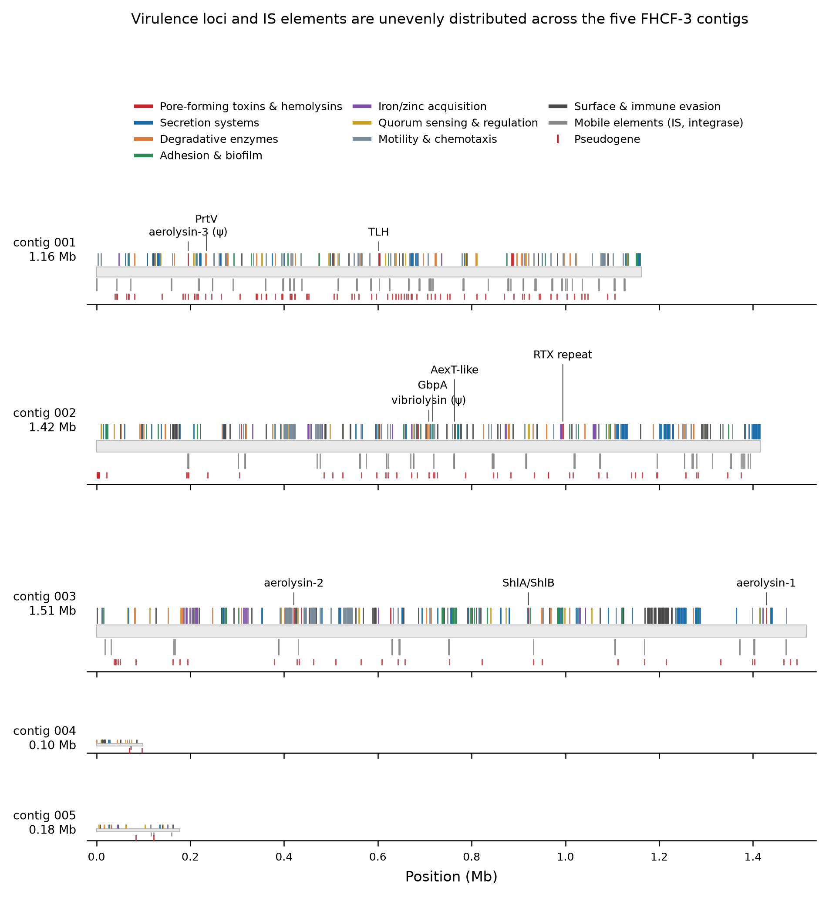
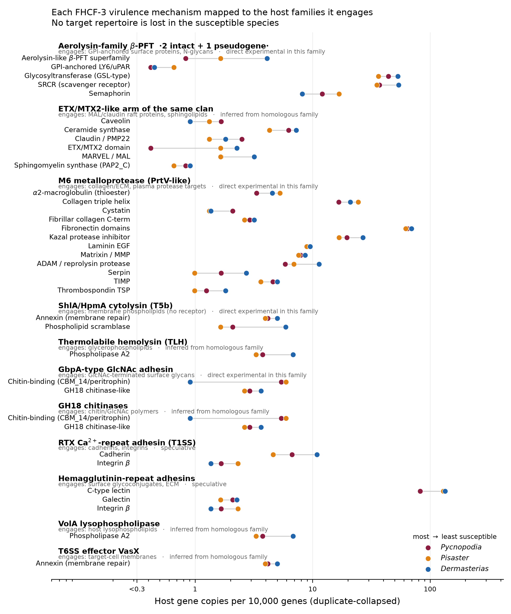

## The short version

Now that *Vibrio pectenicida* FHCF-3 is the confirmed agent of sea star wasting disease, an obvious question follows: why do some sea stars die and others shrug it off? The three species we keep coming back to line up as a clean gradient — sunflower star (*Pycnopodia helianthoides*, most susceptible) \> ochre star (*Pisaster ochraceus*, intermediate) \> leather star (*Dermasterias imbricata*, resistant).

So I put the pathogen's gene catalog next to all three host proteomes and asked whether the gradient is written in gene content.

Two answers, pointing in opposite directions:

-   **The pathogen side is rich and unambiguous.** FHCF-3 carries a complete secreted-toxin delivery system loaded with 16 pore-forming toxin and hemolysin loci, including two intact aerolysin-family toxins.
-   **The host side does not explain the gradient.** Of 50 gene families tested, *none* survives multiple-testing correction. What we get is a ranked list of candidates, not an answer.

## What the pathogen brings

960 of 3,905 FHCF-3 coding loci sorted into ten virulence categories. Delivery is clearly not the limiting step: the T2SS export operon is complete with nothing missing, one T3SS cluster is complete with no pseudogenes, and two separate T6SS clusters carry all 13 core components intact. Sec and Tat backbones are fine.

| Category                           | Loci   |
|------------------------------------|--------|
| Mobile element                     | 186    |
| Secretion system                   | 185    |
| Motility / chemotaxis              | 175    |
| Surface / immune evasion           | 139    |
| Degradative enzyme                 | 75     |
| Adhesion / biofilm                 | 71     |
| Quorum sensing / regulation        | 48     |
| Metal acquisition                  | 43     |
| Toxin-antitoxin module             | 22     |
| **Pore-forming toxin / hemolysin** | **16** |

The aerolysins are the weapon to watch. Two are intact — one at 52% identity to *Aeromonas hydrophila* Aerolysin-4 with the full canonical proaerolysin architecture (pro-domain, β-PFT domain, Sec signal feeding the T2SS), one at 33% identity to the *A. salmonicida* enzyme. A third paralogue is a pseudogene, which is a nice detail: recent decay of a toxin gene in a genome that still holds two working copies.

Around them sit an M6 immune-inhibitor-A metalloprotease at 68% identity to *V. cholerae* PrtV, two thermolabile hemolysins, a 1,180-aa ShlA/HpmA cytolysin with its cognate transporter, a 3,899-aa RTX T1SS substrate, an AexT-like ADP-ribosyltransferase, and a GbpA-type GlcNAc adhesin with GH18 chitinases.

One more thing worth noting: 65 methyl-accepting chemoreceptor loci in a 4.37-Mb genome. That is a lot of sensing hardware for a small genome, and it fits a bacterium that actively goes looking for a host.

## What the hosts do not show

51 host families were scored — the immune repertoire plus every family the pathogen's toxins are known to engage — against a genome-wide permutation background built from orthogroup resampling.

The smallest permutation p-value across 50 testable families is 0.0085 (C-type lectins). After Benjamini-Hochberg, the minimum q is 0.271. Nothing is significant. A naive chi-square test flags six families, but it treats genes as independent draws and is badly anticonservative here; the permutation is the number to trust.

Two mechanistic hypotheses did get positively **excluded** at the gene-content level, which is a real result:

-   **GPI-anchor biosynthesis is complete in all three species.** GPI-anchored surface proteins are the receptor class for aerolysin-family toxins, so the simplest resistance model — the resistant species lost the receptor pathway — is off the table.
-   **Glycosphingolipid and sphingomyelin synthesis is complete in all three.** The raft-lipid route for the ETX/MTX2 arm is not differentiated either.

This also corrected a provisional earlier result of ours: apparent absences of UGCG, SGMS1/2, ST3GAL5 and CERS2-5 turned out to be Swiss-Prot naming artefacts, not gene losses. Worth remembering the next time an absence looks exciting.

Shared effector and ECM machinery — caspases, NF-κB/Rel, IRF, TIR, CARD, MMPs, TIMPs, transglutaminase, fibronectin, laminin, collagen — all vary by less than 1.5-fold. The pathogen's collagen-chewing targets are just as available in the resistant animal.

## The candidates that survive

Effect sizes rank candidates. They do not establish significance. With that said:

**1. Host aerolysin-like β-PFT superfamily — 2 / 5 / 9 copies (4.9-fold, monotonic, p = 0.025).** The only candidate that both follows the gradient and is welded to the pathogen's principal weapon. The resistant leather star has the most; the sunflower star has a single intact gene where the other two carry tandem arrays (a four-gene array within 45 kb in *Pisaster*, a pair plus a triplet in *Dermasterias*). These host proteins are distant clan relatives of the pathogen's toxins (11-20% identity), which makes them interesting three ways: decoy receptors, host effectors in their own right (this is the natterin/EDSP lineage of animal defensive pore-formers), or simply proteins sharing the toxin's glycan-binding surface.

**2. C-type lectins — 82 / 129 / 134 per 10k genes (1.63-fold, monotonic, p = 0.0085).** Lowest p-value in the study, unaffected by duplicate collapse, spread over 21-22 scaffolds per species rather than one expanded gene. Repertoire breadth, not a single amplification.

**3. Fibrinogen-related proteins — 114 / 350 / 45.** Biggest raw difference in the dataset and demonstrably not an artefact, but it is a *Pisaster*-specific expansion (a 54-gene tandem cluster on Scaffold_9), not a gradient. Read it as a lineage trait.

**4. Phospholipid scramblases — 5 / 5 / 13 (resistant-high, p = 0.031).** The ShlA/HpmA cytolysin needs no protein receptor: phosphatidylethanolamine activates it and the bilayer is the substrate. Resistance to that class has to come from lipid asymmetry and membrane repair, and the resistant species carries 2.6-fold more scramblases.

**5. Chitin-binding CBM_14 / peritrophins — 13 / 18 / 2 (resistant-depleted, p = 0.033).** Consistent with a different epidermal glycan surface and fewer adhesion footholds for the GbpA adhesin, but the direction needs independent confirmation.

**6. SRCR receptors and ADAM proteases**, both higher in the resistant species. SRCR is deliberately ambiguous — those proteins are pattern-recognition receptors *and* a documented GPI-anchored surface class, so a higher count could mean more immune sensing or more aerolysin receptors.

## Next?

1.  **Quantify the candidate transcripts in the exposure RNA-seq we already have.** The orthogroup table was built as the cross-species join key for exactly this. Specific question: are the host aerolysin-like genes induced on exposure in the two species that have arrays?
2.  **Toxin-sensitivity assay on coelomocytes** from all three species against recombinant RS18300 proaerolysin and against culture supernatant ± protease inhibition. This tests whether differential susceptibility shows up at single-cell lysis at all — the pivot the entire genomic interpretation rests on.
3.  **Competition test of the decoy hypothesis** — recombinant *Dermasterias* aerolysin-like proteins pre-incubated with proaerolysin, assayed for protection of *Pycnopodia* coelomocytes.
4.  **Resolve GPI-anchoring in the SRCR set** computationally before treating SRCR counts as immune capacity.
5.  **Surface-glycan characterization** of body wall and epidermal mucus by lectin histochemistry or a GbpA binding assay.
6.  **Improve the *Pycnopodia* annotation** before making any further copy-number claim about it. A transcriptome-guided re-annotation would firm up or dissolve candidate 1's most striking feature.

## Notes on how this was done

DIAMOND blastp against UniProtKB/Swiss-Prot 2026_03 for functional annotation; OrthoFinder 3.1.5 for orthogroups (28,963 clusters, 10,071 strict 1:1:1 single-copy); HMMER3 hmmsearch at trusted cutoffs against 77 InterPro-verified Pfam models plus 16 supplementary ones; the full NCBIFAM/TIGRFAM library at trusted cutoffs over the FHCF-3 proteome; Phobius for signal peptides on a 30-protein priority set; MAFFT for the aerolysin alignment. Statistics are a Cochran-Armitage trend test against an empirical null from 4,000 orthogroup resamples per family size, Benjamini-Hochberg across families.

Known limits: BUSCO was not run, so completeness rests on orthogroup recovery metrics; the Pfam scan is targeted, so an empty family row means no hit to those specific models rather than genome-wide absence; signal-peptide prediction covered 30 of 3,582 FHCF-3 proteins; and the *V. splendidus* comparator is not a confirmed non-pathogen, so it is indicative only.
