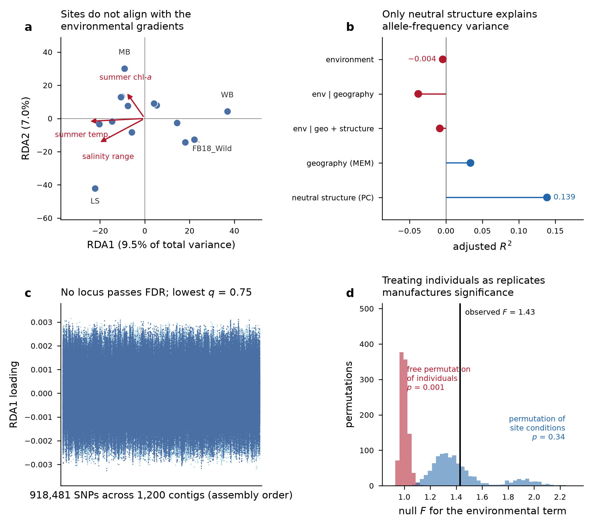
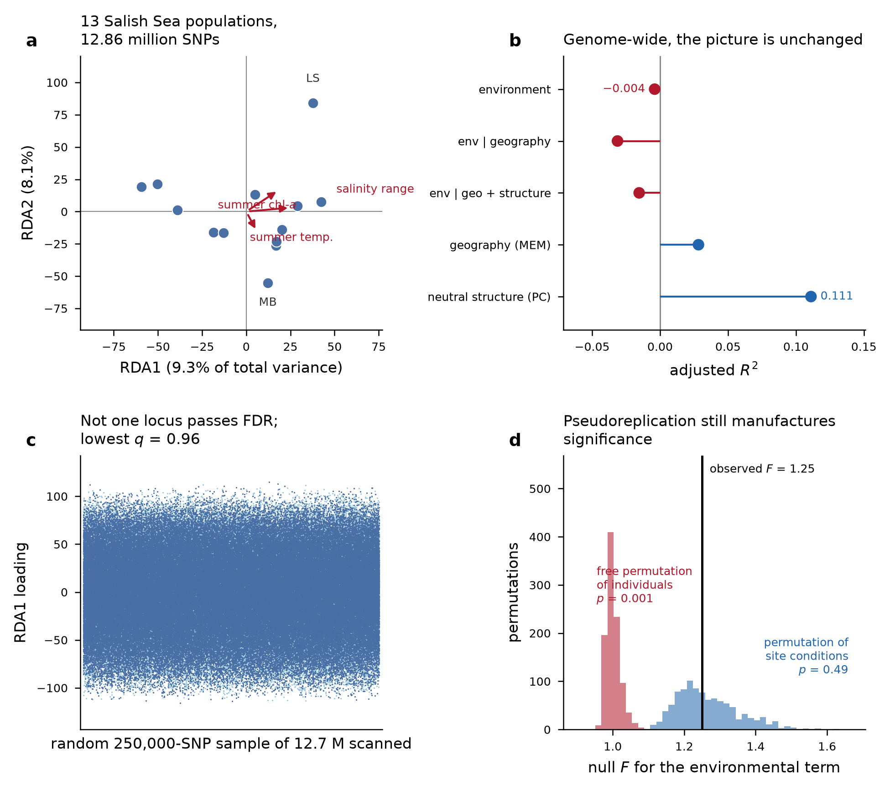

<a href="https://robertslab.github.io/resources/Agentic-Coding-Tools/#five-level-rubric"></a>

## Summary

We tested whether allele frequencies across 15 Olympia oyster (*Ostrea lurida*) collections track local environmental conditions, using redundancy analysis on low-coverage whole-genome data. **They do not.** Across 12,858,328 SNPs and 13 populations with complete environmental data, the environmental term explains no more variance than chance (adjusted *R*² = −0.004, *p* = 0.55); conditioning on geography makes it worse; forward selection admits no predictors; no constrained axis is significant; and no locus passes FDR (lowest *q* = 0.96). An annotation-guided follow-up on a new chromosome-scale assembly, testing *a priori* gene sets instead of every marker, is also negative (lowest BH *q* = 0.46).

Neutral population structure, by contrast, is real and substantial (adjusted *R*² = 0.111). The data are informative; the environmental hypothesis is the thing that fails.

Two results we were not looking for turned out to matter more than the primary one: a mislabelled site, and a clear demonstration that the binding constraint on this design is the number of sampled sites rather than anything about sequencing.

## Question

Restoration programs move Olympia oysters between beds. If populations are locally adapted, source choice has consequences for performance; if they are not, sourcing can be decided on logistics, disease history and genetic diversity. Genotype-environment association (GEA) asks the genetic version of this question directly: do allele frequencies covary with site conditions, over and above ancestry and geographic proximity?

The distinction that matters, and that Fst alone cannot address: *populations differ* is nearly always true and is mostly drift; *populations differ because of their environment* is a much stronger claim and is the one relevant to sourcing.

## Data

Low-coverage whole-genome sequencing of 112 libraries from 15 putative collection sites (13 in Puget Sound and the Strait of Juan de Fuca, one on the outer Washington coast, one in Coos Bay, Oregon). Repository: `github.com/zbengt/oly-lc-WGS`; alignments and variants served over HTTP from a lab web host.

After QC, **109 libraries** were retained. Two blanks and one library far below the depth threshold were dropped. Mean depth of retained samples was 5.48× (range 3.46–6.73), 5–8 individuals per site.

### Environmental layer (rebuilt)

The environmental data committed with the repository were not usable as predictors: a 30-day window in which all 15 sites collapsed onto 5 water-temperature stations 12–69 km away. Most of what that layer called "environment" was really basin identity.

We rebuilt it from **Washington Department of Ecology monthly CTD casts, 2013–2018**, restricted to the 0–5 m band, giving **13 unique stations at 0.4–23.3 km**. Predictors, chosen to keep collinearity manageable against a small number of sites:

| predictor          | meaning                                        |
|--------------------|------------------------------------------------|
| `temp_summer_mean` | mean June–August water temperature             |
| `sal_amplitude`    | seasonal salinity range                        |
| `chl_summer_mean`  | summer chlorophyll-*a*, as a food-supply proxy |

Two sites carry temperature only and are excluded from the multivariate model: Coos Bay (no accessible Oregon source supplied salinity, oxygen or chlorophyll) and Willapa Bay (outside the Ecology Salish Sea program; the only long marine record in the bay is a NOAA CO-OPS temperature gauge 23 km from the beds). That leaves **13 populations, 94 individuals** in the constrained models.

Spatial structure was captured by distance-based Moran eigenvector maps (`MEM1`, `MEM2`); neutral ancestry by the first two structure PCs.

### Genotypes

Genotypes came from the joint VCF's likelihoods rather than from BAM-level re-estimation. Filtering with `bcftools`: biallelic SNPs, QUAL ≥ 30, MQ ≥ 30, `F_MISSING` \< 0.2, MAF 0.05–0.95, plus an excess-heterozygosity screen (`ExcHet` \> 1e-6) as a paralog guard.

| stage                             | SNPs           |
|-----------------------------------|----------------|
| after bcftools filters            | 14,250,907     |
| dropped — excess depth            | 14,250         |
| dropped — missing in a population | 1,903          |
| dropped — MAF \< 0.05             | 1,376,098      |
| **retained**                      | **12,858,656** |
| thinned subset for structure      | 174,534        |

Population allele frequencies **pool sequencing reads within a site** (summed ALT depth over summed total depth) rather than averaging per-individual calls, which at \~5× would be biased toward homozygotes. Individual dosages are read-based, carrying depth uncertainty forward.

## Methods

### Redundancy analysis

Population allele frequencies (SNPs standardised across populations) were regressed on the three predictors, with partial RDA conditioning separately and jointly on geography (MEM) and ancestry (structure PCs). An individual-level model was fitted in parallel.

**Fitting in principal coordinates.** With 13 populations and \~1.3 × 10⁷ SNPs, the response matrix cannot be held in memory. A direct fit exhausted R's 16 GB vector limit at 918k columns. But an RDA depends on the response only through its *row space*, so we compute the Gram matrix of the column-standardised frequency matrix, take `Ypc = U·diag(s)`, and fit that instead. This is exact, not an approximation: eigenvalues, *R*², *F* and permutation *p*-values are identical. Total inertia must equal the SNP count, and that identity is asserted in every script as a correctness check. SNP loadings are recovered afterwards by back-projection.

### Permutation design (the part that changes the answer)

Environmental predictors are **constant within a site**. Permuting individuals freely would treat 94 oysters as 94 independent tests of temperature when they are really 13. We therefore permute **site condition vectors among sites**, keeping each individual attached to its own site.

`vegan`'s `Plots(strata=)` scheme cannot be used here because it requires balanced plots and our sites hold 5–8 individuals, so the restricted permutation is implemented directly, with the *F* statistic computed from the constrained and residual components.

The difference is not cosmetic:

| null                                          | *F*   | *p*       |
|-----------------------------------------------|-------|-----------|
| permute site conditions among sites (correct) | 1.250 | **0.495** |
| permute individuals freely (pseudoreplicated) | 1.250 | **0.001** |

Same data, same model, same *F*. Any GEA result on a design like this that permutes individuals freely is measuring pseudoreplication.

### Scaling to the whole genome

The first pass used the 1,200 highest-variant-density contigs, 7.4% of the VCF's records, not by choice but because the 24.5 GB joint VCF transfers to the analysis sandbox at \~1.5 MB/s. The lab compute host pulls the same file at \~94 MB/s, so the full file was filtered there: all 158,839 contigs across 24 parallel workers, 25 minutes wall.

### Annotation-guided follow-up

A chromosome-scale Dovetail Hi-C assembly (PO2457: 1.023 Gb, 145 scaffolds, N50 103 Mb, 10 scaffolds ≥ 10 Mb holding 98.7%) became available with MAKER annotation, 34,178 gene models and a RepeatMasker track covering 61.2% of the assembly. The original reference (`Olurida_v081`, 158,839 contigs, N50 13 kb) had no usable annotation.

This enables a better-powered question. A scan of 12.7 M markers against 9 residual degrees of freedom is a multiplicity problem more than a test; 12 targeted tests informed by prior biology is not. We lifted the SNP set onto the new scaffolds with `minimap2 -cx asm20` (the `asm20` preset because this is a different individual and *Ostrea* is highly polymorphic), dropped repeat-masked positions, assigned SNPs to gene bodies ± 2 kb, and tested four gene sets built from the annotation's UniProt-style `Note` fields.

The null is again restricted permutation of the predictor across the 13 populations, 999 times. This matters because a per-gene maximum statistic is strongly biased by SNP count. Genes here hold a median of 61 SNPs and a maximum of 2,487, and permuting the predictor holds every gene's SNP count, internal LD and the genome-wide correlation structure exactly fixed.

## Results

### Variance partitioning

Genome-wide, 13 populations, 12,858,328 SNPs:

| component                           | *R*²  | adjusted *R*² |
|-------------------------------------|-------|---------------|
| environment (marginal)              | 0.247 | **−0.004**    |
| geography MEM (marginal)            | 0.190 | 0.028         |
| **ancestry PC (marginal)**          | 0.259 | **0.111**     |
| environment \| geography            | 0.225 | −0.031        |
| environment \| ancestry             | 0.219 | −0.006        |
| environment \| geography + ancestry | 0.218 | −0.015        |
| full model                          | 0.620 | 0.088         |

Negative adjusted *R*² is what a predictor that does not earn its keep looks like after the penalty for model complexity. Ancestry is the only component carrying real signal.

### Significance

| test                             | statistic   | *p*   |
|----------------------------------|-------------|-------|
| environment, global              | *F* = 0.984 | 0.545 |
| environment \| geography, global | *F* = 0.896 | 0.910 |
| temperature term                 | *F* = 1.111 | 0.164 |
| salinity range term              | *F* = 0.945 | 0.513 |
| chlorophyll term                 | *F* = 0.896 | 0.697 |
| first constrained axis (RDA1)    | *F* = 1.115 | 0.637 |

Forward selection (`ordiR2step`, 999 permutations) admitted **zero** predictors. The marginal temperature hint present in the 7.4% subset (term *p* = 0.068) **disappears at genome scale** (*p* = 0.164). The subset was enriched for variable regions, not a random genomic sample.

### No candidate loci

A Mahalanobis scan on constrained-axis loadings under a robust (MCD) covariance returned **zero loci** at *q* \< 0.05, *q* \< 0.10 and *q* \< 0.20, on both the subset (lowest *q* = 0.75) and genome-wide (lowest *q* = 0.96).

A permissive 3-SD cut-off returns 1,342 loci on the subset and 10,615 genome-wide. Those are the tail of a null distribution from a model that is not globally significant, and we are deliberately not reporting them as candidates. If a GEA paper shows a gene list without FDR correction, this is the number that was skipped.

### Robustness

| variation                                      | sites | *p*       |
|------------------------------------------------|-------|-----------|
| main model, 3 predictors                       | 13    | 0.545     |
| drop the sites with uncertain labels           | 10    | 0.919     |
| merge the two Fidalgo Bay collections          | 12    | 0.562     |
| temperature alone                              | 15    | 0.338     |
| temperature alone, conditioned on geography    | 15    | 0.173     |
| **temperature alone, conditioned on ancestry** | 15    | **0.025** |
| temperature alone, Ecology-measured sites only | 13    | 0.128     |

One test is nominally significant, and we are not claiming it. It is one of four temperature models (correcting for that alone gives *p* ≈ 0.10), it explains \~1% of variance (adjusted *R*² = 0.0098), and the same predictor fails both without the ancestry correction and on the Ecology-measured sites alone. Temperature remains the most plausible candidate and it remains unsupported.

### Gene-set tests

Lift-over of 12,710,660 SNPs: 7,650,471 (60.2%) placed on the new assembly from 127,066 of 158,839 old contigs (80.0%); 2,957,241 dropped as repeat-masked; **1,988,871 (15.6% of input)** assigned to a gene body ± 2 kb. 20,846 of 34,178 genes carried ≥ 5 SNPs.

| gene set | genes | SNPs | predictor | observed | null | *p* | BH *q* |
|---------|---------|---------|---------|---------|---------|---------|---------|
| immune recognition | 248 | 24,058 | temperature | 0.642 | 0.609 ± 0.018 | 0.050 | 0.46 |
| heat shock / chaperone | 92 | 11,142 | temperature | 0.655 | 0.620 ± 0.023 | 0.084 | 0.46 |
| ion & solute transport | 400 | 55,375 | temperature | 0.638 | 0.625 ± 0.020 | 0.220 | 0.46 |
| oxidative stress | 36 | 3,235 | temperature | 0.615 | 0.596 ± 0.027 | 0.225 | 0.46 |

No gene passes FDR for any predictor (lowest *q* = 0.54 temperature, 0.81 salinity, 1.00 chlorophyll across 20,846 genes). The two smallest set-level *p*-values are both against temperature, the predictor with the strongest prior, but neither survives correction and both sit under 2 SD from their nulls.

### Figures





## The two unplanned findings

### A site is mislabelled

A collection recorded as "WB" and inferred in the repository to be Westcott Bay, San Juan Island, is genetically not a Puget Sound population. Genome-wide Hudson's Fst:

| comparison                    | Fst       |
|-------------------------------|-----------|
| Coos Bay ↔ WB                 | **0.097** |
| among the 13 Salish Sea sites | 0.115     |
| Coos Bay ↔ Salish Sea (mean)  | 0.174     |
| WB ↔ Salish Sea (mean)        | 0.174     |

WB is *closer to Oregon* than Salish Sea sites are to each other. Reinterpreting it as **Willapa Bay**, an outer-coast estuary, makes this ordinary: two outer-coast populations resembling one another. Three site labels in this dataset remain inferred rather than read from collection records.

This is not a bookkeeping detail. The label determines which environmental values a site receives. As "Westcott Bay" the site was assigned the coldest summer temperature in the dataset (10.8 °C) while carrying the most distinctive genetics; as Willapa Bay it is 16.3 °C, near the warm end. Part of the earlier apparent temperature signal was that mislabelling.

### Sequencing was never the limitation

|                           | 7.4% subset | full VCF   |
|---------------------------|-------------|------------|
| SNPs                      | 918,481     | 12,858,328 |
| environment adjusted *R*² | −0.0043     | −0.0040    |
| environment *p*           | 0.499       | 0.545      |
| lowest *q* across loci    | 0.75        | 0.96       |

A 14× increase in markers moved nothing, and this is expected rather than surprising: the response's rank is bounded by the number of *populations* (≤ 12), leaving 9 residual degrees of freedom in the environmental model. More markers cannot buy degrees of freedom the sampling design does not have.

## What this does and does not mean

**Supported:** these three basin-scale predictors, across the complete genome and 13 populations, explain no allele-frequency variance beyond ancestry and geography.

**Not supported:** that Olympia oysters are not locally adapted. Three design features could hide a real signal:

1.  Conditions were measured mid-channel, kilometres away, as monthly means, erasing exactly the intertidal extremes most plausible as selective agents.
2.  13 sites is very little environmental replication, whatever the marker count.
3.  Polygenic adaptation on many loci of small effect is poorly served by this method.

What has now been *excluded* as explanations: marker count, reference contiguity, repeat contamination, and lack of functional annotation. Each was tested; none changed the answer.

## What would change the answer

|   | buys | cost |
|------------------------|------------------------|------------------------|
| Temperature/salinity loggers on the beds | what the animals actually experience, instead of basin averages | low |
| Resolve the three uncertain site labels | removes the failure mode demonstrated above | archival |
| Add sites along a real environmental gradient | environmental replication, the binding constraint | moderate |
| Common-garden or reciprocal transplant | measures performance directly rather than inferring it | high |
| More sequencing | nothing, we now have direct evidence | — |

## Notes to self

-   **Fit in principal coordinates from the Gram matrix.** The exactness argument (RDA sees the response only through its row space) is what makes a 12.9-million-column response tractable at all. Assert `total inertia == n_snp` every time; it caught two transposition errors.
-   **Standardise the right axis.** Twice, draft code standardised across SNPs instead of across populations. The inertia assertion caught both before they reached a result.
-   **Unit-test the lift-over.** The CIGAR walk was checked against synthetic forward, reverse, deletion and insertion alignments before submission. The insertion case matters most: query bases inside an insertion must be *dropped*, not approximated, or SNPs land silently in the wrong gene.
-   **34% of SNPs failed to lift** for falling outside an alignment block. Dropping them is correct but it is the largest single loss in that step, and it means the gene-set test sees 15.6% of the original markers.
-   **Annotation is the ceiling on the gene-set approach.** 16,548 of 34,178 genes are "Protein of unknown function", and BUSCO completeness is moderate (mollusca `C:80.1%`, `M:17.4%`). A gene set can only be tested to the extent the annotation names its members.
-   **The lift-over inherits the old alignment.** It moves coordinates; it does not re-derive genotypes, so paralog artefacts from a 158,839-contig reference persist. A positive result would have needed confirmation on a fresh alignment.
-   Infrastructure: SSH connection multiplexing failed after the socket directory under `/tmp` was swept, producing `unix_listener: cannot bind to path`. Every remote call failed with exit 255 while interactive `ssh` worked fine, which made it look like a stalled approval. Recreating the directory fixes it.

## Reproducibility

Seeds fixed at 42 throughout; 999 permutations everywhere.

``` bash
# environmental layer and genotype matrices
python code/05_environmental_predictors.py
python code/06_genotype_matrix.py

# subset RDA
python code/07_prepare_rda_inputs.py
Rscript code/07_rda.R
Rscript code/07b_candidates.R
Rscript code/07c_figure_inputs.R
python code/07d_figure.py

# genome-wide (lab compute host)
bash work/gw/run_gw.sh                  # calls work/gw/oly_gw.py worker|merge
Rscript code/10_rda_genomewide.R
python work/gw/scan.py <workdir> axis-site-scores.tsv sample_pop.tsv out
Rscript code/10b_temp_only.R
python code/10c_figure.py

# lift-over to the chromosome-scale assembly and gene-set tests
minimap2 -cx asm20 -t 46 --secondary=no Ol_PO2457.fasta Olurida_v081.fa > old2new.paf
python work/newasm/liftgene.py <workdir> old2new.paf annotation.gff.gz \
                               repeats.gff.gz pop_env13.tsv out
```

Full methods and limitations: `output/07_rda/README.md`, `output/10_rda_genomewide/README.md`, `output/13_liftover_geneset/README.md`.
