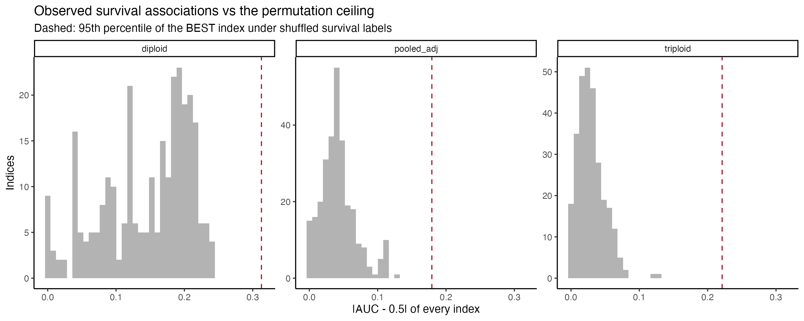
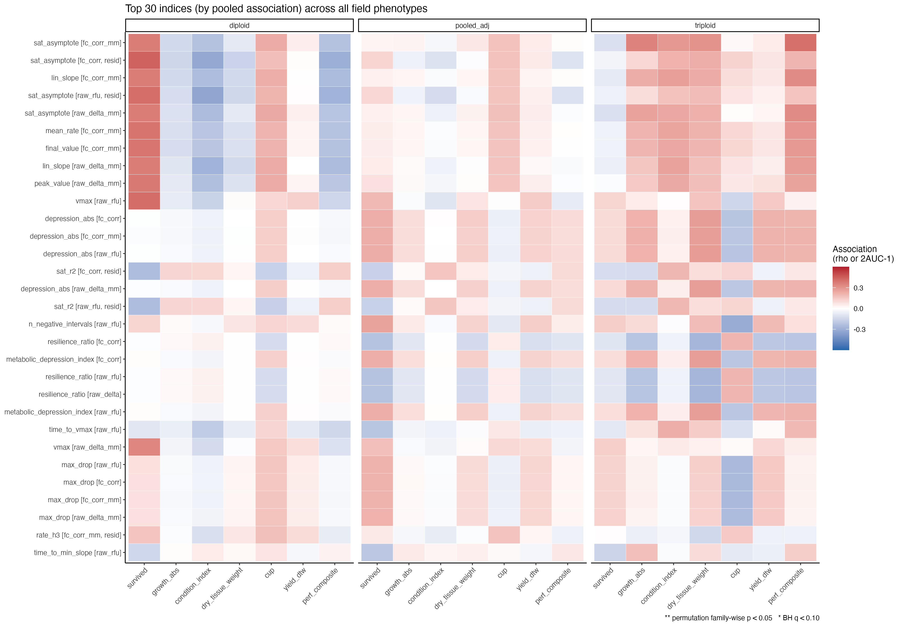
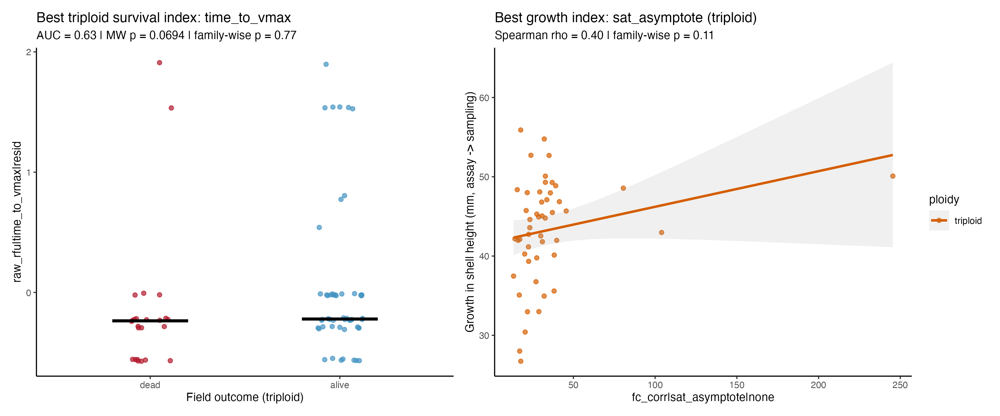
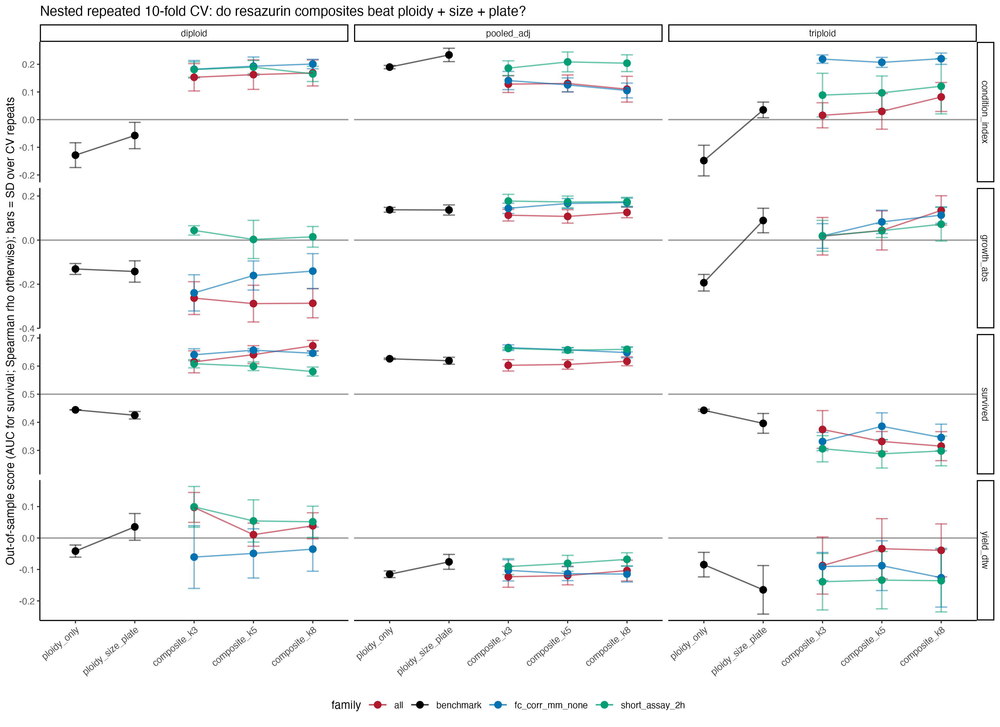
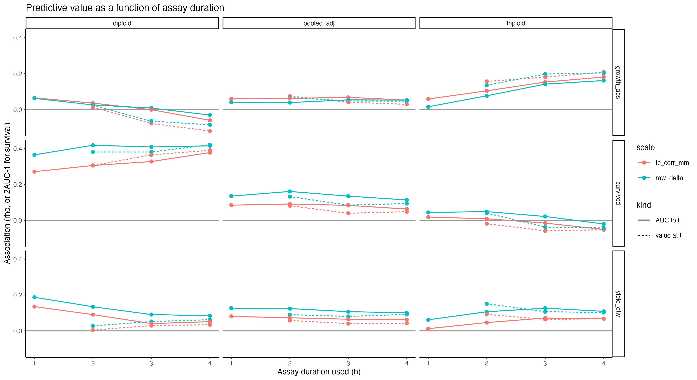
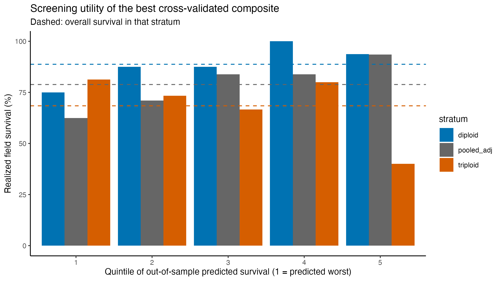

## TL;DR

Zero of the 284 distinct indices cleared family-wise *p* \< 0.05 for survival, growth, condition index, tissue weight, cup, yield, or the performance composite. Not one.

The closest calls, in order of how much I believe them:

1.  **Triploid growth and tissue weight.** The fitted metabolic plateau (`sat_asymptote`) and the second-hour rate (`rate_h2`) correlate at rho 0.40 to 0.42 with growth in shell height and dry tissue weight. Family-wise *p* is 0.08 to 0.11, so it is just short of the ceiling. Cross-validated single-index prediction keeps rho around 0.28, and the composites beat the size-plus-plate benchmark by a similar margin. This is the one signal that shows up across several related features, several scales, and two related phenotypes. Caveat: a few high-plateau animals do some of the work.
2.  **Diploid survival.** Size-and-plate-adjusted capacity features (`final_value`, `mean_rate`, `auc_total`) give AUC around 0.74, and a nested composite holds AUC 0.67 out of sample against a 0.43 benchmark. But this rests on nine deaths, and the direction (higher output, better survival) is opposite to the family-level USDA result, so I would call it a hypothesis, not a finding.
3.  **Diploid condition index.** The late-minus-early AUC difference correlates at rho -0.35, family-wise *p* 0.09. Weak and single-feature.

Everything else, including triploid survival, is indistinguishable from noise.

Two design differences are the most likely explanations for why this looks so much weaker than the USDA family work, and both are about information content rather than about the assay failing:

-   **One family.** Every animal here is HNRY. The USDA result was built on variation *among* families, which is where most of the heritable signal in this kind of trait sits. Within a single family we are asking the assay to resolve individual variation against a background of shared genetics, and there is simply much less to find.
-   **Endpoint survival instead of duration of survival.** The field phenotype here is binary: alive or dead at one sampling. The USDA families were scored on how long each animal survived in the lab challenge, a graded response that uses every animal rather than only the ones that crossed the line. Collapsing that to a single endpoint throws away most of the resolution, and it is a large part of why 33 deaths buy so little here.

So the honest summary: in this cohort, a pre-deployment 40 °C resazurin trace carries a small amount of information about how much a triploid will grow, possibly about whether a diploid will survive, and essentially none about triploid mortality. None of it is strong enough to use as a screen today. The next deployment, ideally with more deaths and a recorded field duration, is what would confirm or kill the triploid growth lead.

## What this was

The question: of every index that can be gleaned from a 4-hour resazurin run on an individual oyster, which ones forecast that same animal's field performance, and how should the assay be normalized, truncated, and combined to do so?

The analysis is a fresh, self-contained pass at the 2025-08-26 ploidy trial (HNRY family, one day, 40 °C), starting from the **raw plate-reader files** rather than the processed `ploidy_metabolism.csv`. That matters because absolute fluorescence, blank-subtracted resorufin production, un-normalized fold change, actual elapsed read times, and baseline autofluorescence are all lost by the time the data reach the processed CSV.

It differs from the family-level prediction notebook in `sormi-assay-development` in three ways:

-   **Individual-level linkage.** The same animal was assayed, tagged, deployed, and sampled, so n is \~160 individuals rather than \~9 family means.
-   **Every scale and every feature.** Five value scales × \~45 curve features × two size/plate adjustments, catalogued and then de-duplicated to \~280 distinct indices.
-   **Honest multiplicity control.** With several hundred candidates, nominal *p*-values are meaningless. Every screen is calibrated against a permutation null for the *best* index in the family, every composite is built with nested feature selection inside the cross-validation loop, and every out-of-sample score is compared against a ploidy + size + plate benchmark fitted the same way.

That last point is the reason for the flat TL;DR. On the survival screen the best index reaches AUC \~0.68 pooled and \~0.81 in diploids **by chance alone** at these death counts. The observed maxima, 0.63 and 0.74, sit below their own null ceilings.

The heatmap below is the whole catalogue in one view: the 30 indices with the strongest pooled association, against every field phenotype, by stratum. Warm and cool blocks swap sides between diploid and triploid panels more often than they agree.

## The numbers

Best single index per stratum for survival (AUC, family-wise permutation *p*):

-   diploid: `final_value` on `fc_corr_mm`, size/plate-adjusted, AUC = 0.74 (n = 80, 9 dead), family-wise *p* = 0.32
-   pooled: `n_negative_intervals` on `raw_rfu`, AUC = 0.63 (n = 156, 33 dead), family-wise *p* = 0.41
-   triploid: `time_to_vmax` on `raw_rfu`, adjusted, AUC = 0.63 (n = 76, 24 dead), family-wise *p* = 0.77

0 of 852 index × stratum tests cleared the 0.05 family-wise threshold.

Best single index per continuous phenotype:

-   dry tissue weight: `rate_h2` on `fc_corr_mm` (adj), triploid, rho = 0.42 (n = 52), *p* = 0.08
-   growth: `sat_asymptote` on `fc_corr`, triploid, rho = 0.40 (n = 49), *p* = 0.11
-   performance composite: same index, rho = 0.40, *p* = 0.11
-   condition index: `delta_auc_late_minus_early` on `raw_rfu`, diploid, rho = -0.35 (n = 71), *p* = 0.09
-   cup: `baseline_value` on `raw_rfu` (adj), triploid, rho = -0.33, *p* = 0.36
-   yield (DTW): `time_to_vmax` on `raw_rfu` (adj), triploid, rho = 0.23, *p* = 0.63

## Three things that came out sideways

**Capacity means different things in the two ploidies.** Diploids that produced *more* resorufin per mm at 40 °C were more likely to be alive at sampling; in triploids the same capacity-type indices track growth, not survival; and for condition index in diploids they go the other way entirely. That argues for scoring ploidies separately rather than pooling.

**Triploid survival is simply not in the trace.** Despite three times as many deaths as in diploids, no index exceeds AUC 0.63 in either direction, and the nested composites fall *below* 0.5, which is the signature of selecting on noise. Whatever killed the triploids in the field is not visible in their 4-hour 40 °C trajectory at deployment.

**Normalization matters less than expected; adjustment matters more.** Dividing by shell length (`fc_corr_mm`) versus not (`fc_corr`) changes little once plate and size are regressed out. Keep the existing pipeline, but always test features after adjusting for assay size and plate.

And one practical note: **a 2-hour read is not clearly worse than 4 hours.** The `short_assay_2h` composite is within one SD of the best full-assay composite for pooled survival and matches or exceeds it for growth and condition. The assay-duration curves are flat after 2 h in the pooled stratum. If this is ever run at scale, that is the thread to pull.

## Screening value today

Culling the predicted-worst quintile on the best out-of-sample composite would raise realized survival by three to four percentage points in diploids and the pooled set, and would *lower* it in triploids. Not a usable screen.

## Next

1.  Record the field sampling date and days at sea so growth can be expressed per day.
2.  Add a non-stressed ambient-temperature control run on the same animals, so stress *response* (40 °C minus ambient) can join the catalogue.
3.  Re-run with the 2025-08-13 cohort once its field outcomes exist. The catalogue gains power fastest from more deaths, not more indices.

Full notebook and rendered report: [resazurin-ploidy-index-catalogue-field-prediction](https://github.com/RobertsLab/vims-resazurin/blob/main/code/ploidy/resazurin-ploidy-index-catalogue-field-prediction.md) in `vims-resazurin`, with all CSV outputs and figures under `output/ploidy/resazurin-index-catalogue/`.
