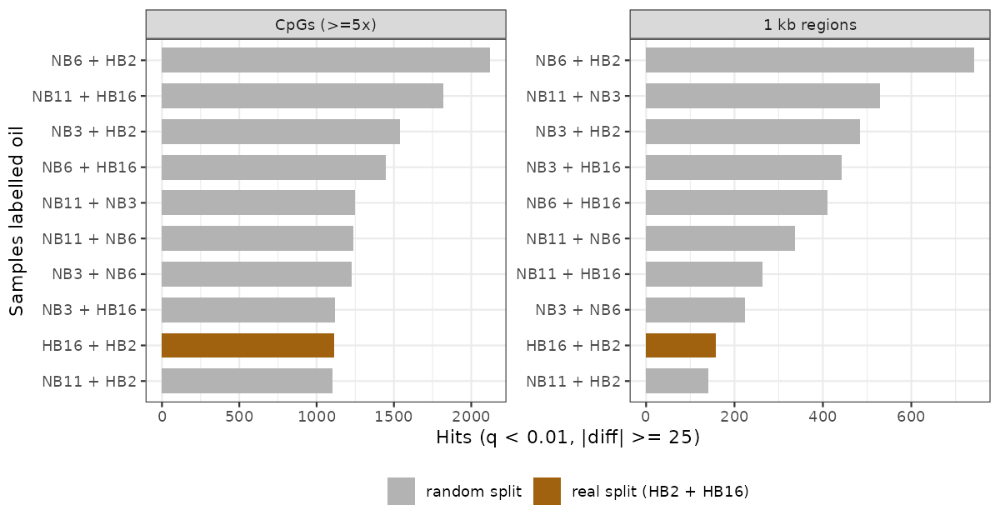
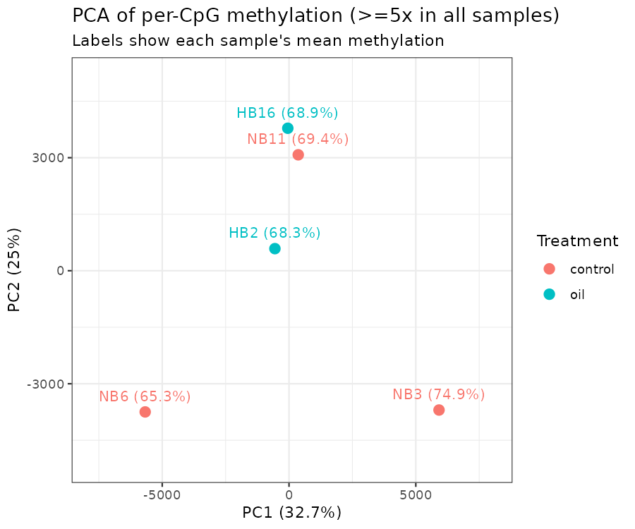
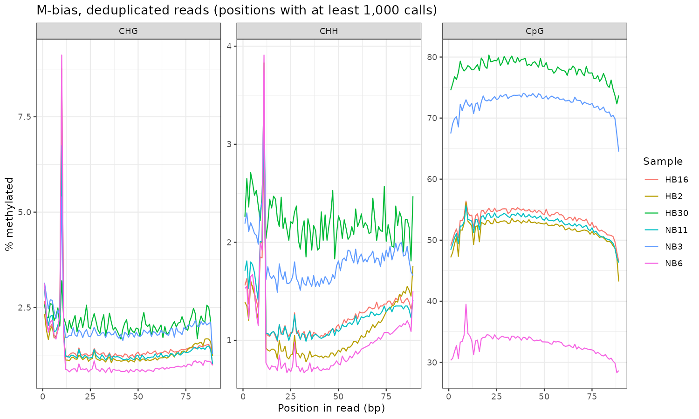
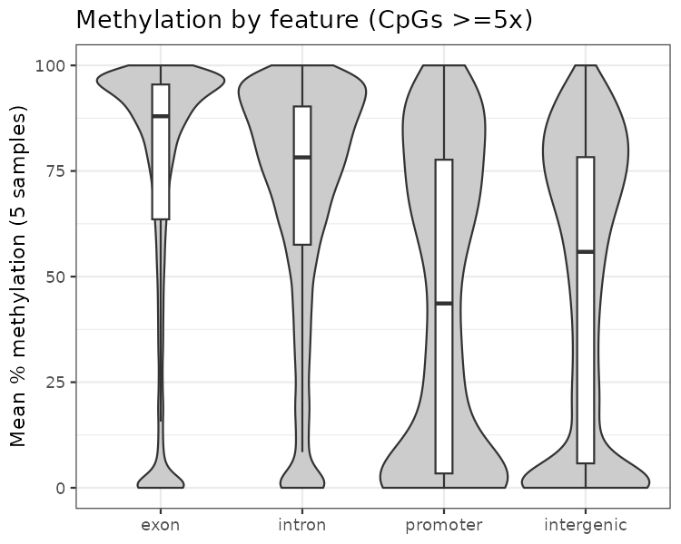
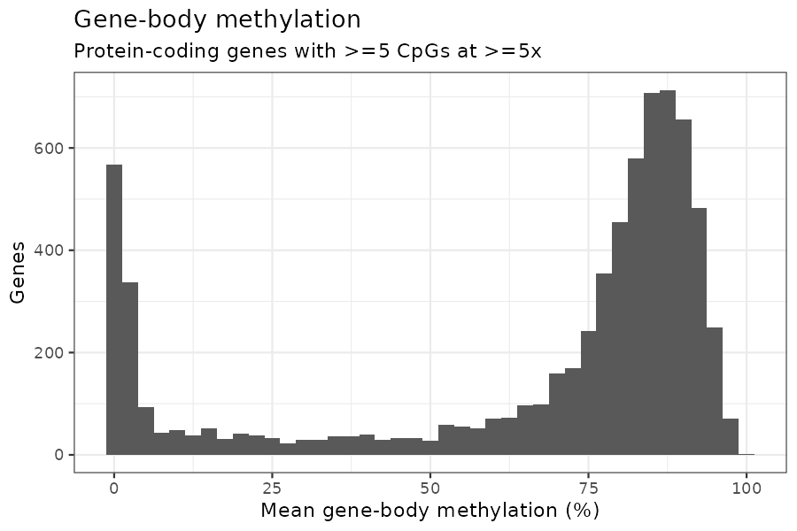

## Why

SRP139854 (BioProject PRJNA449904) is six eastern oyster gill libraries from 2015: three unexposed (NB3, NB6, NB11) and three exposed to 25,000 ppm oil (HB2, HB16, HB30). Single-end 101 bp, HiSeq 2500. SRA lists the selection as "5-methylcytidine antibody" with a bisulfite-seq strategy, so these are methyl-enriched libraries that were then bisulfite converted. The question is simple: does oil exposure change gill DNA methylation?

Everything is in [project-gulf](https://github.com/sr320/project-gulf) as seven numbered notebooks (`code/01` to `code/07`), with every decision and number logged in `plan.md`.

## The answer

**No oil effect I can detect.** methylKit finds 1,111 differentially methylated CpGs at ≥5× (q \< 0.01, \|Δ\| ≥ 25) and 158 DMRs in 1 kb tiles. But with 3 controls vs. 2 oil there are only 10 ways to pick which two samples are "oil". I ran every one. The real split ranks **9 of 10** for both CpGs and regions.

The random splits give more hits than the real one, and their direction follows single samples. Every split containing NB6 (the least methylated sample) comes out mostly hypomethylated in "oil": 696 of 742 DMRs for NB6 + HB2. Every split with NB3 (the most methylated) comes out mostly hypermethylated: 501 of 529 for NB11 + NB3. The test is picking up per-sample global methylation, and the real split sits among the noise.

PCA says the same thing. PC1 (33%) runs from NB6 to NB3, both controls. HB2 and HB16 sit in the middle next to control NB11, and HB16 correlates best with NB11 (r = 0.82).

This is not evidence that oil does nothing. At 3 v 2, the smallest achievable permutation p is 0.1, and the technical noise below is bigger than any plausible treatment effect.

## Getting clean calls took most of the work

### Adapter dimers got past default trimming

Trim Galore (2.3.0) auto-detects and searches only the first 13 bp of the Illumina adapter. Dimers with sequencing errors in the first bases (`GACCGGAAGAGC…`) or missing the first four bases (`CGGAAGAGC…`) slipped through: 1.6–6.5% of trimmed reads, and 22% in HB30. Passing both the full 33 bp TruSeq adapter and a 4 bp-truncated copy dropped this to ≤0.03%. Also turned off poly-G trimming, which 2.3.0 switches on automatically. This is 4-colour HiSeq data, so G runs are real.

### A lot of the reads were never bisulfite converted

First Bismark pass reported CHH methylation of 22–73%. It should be under 1% in oyster. C and G content per read showed a second population with both bases at normal levels, i.e. unconverted. `filter_non_conversion` (≥3 methylated non-CpG calls) removed them before deduplication.

### PBAT-style strands and a strong 5′ bias

After filtering, 77–97% of alignments land on the complementary strands (CTOT/CTOB). That looks like a post-bisulfite adapter tagging kit, not a fully non-directional one. I aligned `--non_directional` anyway to keep the 3–23% on OT/OB. `--score_min L,0,-0.6` beat the default by 7–15 points of converted mapping in every sample, with no rise in the unconverted share.

M-bias shows non-CpG methylation of 10–31% over the first 6 bases, plus junk at the last 1–2. The spike at position 20 is the last base of reads trimmed to the 20 bp minimum. Extraction uses `--ignore 10 --ignore_3prime 2`.

| sample | group   | mapping | unconverted removed | duplicates | conversion | final reads |
|-----------|-----------|-----------|-----------|-----------|-----------|-----------|
| NB3    | control | 48.5%   | 33.1%               | 72.7%      | 98.1%      | 1.09 M      |
| NB6    | control | 38.8%   | 19.1%               | 38.9%      | 99.0%      | 4.02 M      |
| NB11   | control | 51.9%   | 27.7%               | 62.4%      | 98.7%      | 4.44 M      |
| HB2    | oil     | 48.0%   | 32.9%               | 48.4%      | 98.8%      | 4.74 M      |
| HB16   | oil     | 51.4%   | 20.0%               | 58.1%      | 98.7%      | 3.72 M      |
| HB30   | oil     | 42.0%   | 53.2%               | 65.4%      | 97.8%      | 0.19 M      |

Conversion is 100 − non-CpG methylation after filtering. Only NB6 reaches 99%, and the ones with more residual non-CpG methylation (NB3, HB30) are also the most CpG-methylated. I read that as partial conversion still inflating calls.

### Two decisions

-   **Dropped HB30.** 14,350 CpGs at ≥10× (deduplicated) vs. 144,000–436,000 for the others. Keeping it cuts CpGs shared by all samples from 80,785 to 9,995 at ≥10×.
-   **Used deduplicated calls.** Per-CpG methylation agrees with the non-deduplicated calls at r = 0.986–0.992, so duplicates add coverage but not information. They would just inflate confidence in the tests.

That leaves 3 v 2, and global methylation among the three controls alone spans 36% (NB6) to 72.5% (NB3).

## The methylation landscape is the part worth keeping

This doesn't depend on treatment. 14.46 M CpGs in the genome against the 167,693 covered at ≥5× in all five samples:

| feature    | genome CpGs | tested CpGs | relative coverage | mean meth | \>50% meth |
|------------|------------|------------|------------|------------|------------|
| exon       | 16.1%       | 72.9%       | 4.53×             | 72.6%     | 79.8%      |
| intron     | 38.7%       | 17.1%       | 0.44×             | 68.8%     | 79.4%      |
| promoter   | 4.9%        | 0.8%        | 0.16×             | 43.5%     | 48.0%      |
| intergenic | 40.4%       | 9.2%        | 0.23×             | 47.2%     | 53.8%      |

Methylation sits in gene bodies, especially exons, which is what you'd expect for an invertebrate and for MBD enrichment. Promoter and intergenic CpGs split into unmethylated and methylated groups.

Gene-body methylation is cleanly bimodal. Of 6,984 protein-coding genes with ≥5 tested CpGs, 74% are ≥60% methylated, 15% are under 10%, and 11% are in between. About 27,600 protein-coding genes don't have the coverage to score, so the unmethylated mode is probably under-represented.

TEs are thin here. NCBI's RepeatMasker output labels almost every non-simple repeat `DNA?`. They hold 3.0% of genome CpGs, 1.7% of tested, and are slightly more methylated (77.5% vs. 69.2%).

## Annotation of the hits didn't rescue anything

I ran the same annotation on all ten splits so the real one could be compared against noise, not just background.

-   The real split's DMLs are more exonic (80.6%) than any random split's (69.4–78.8%; background 73.0%). With nine comparisons that is p ≈ 0.1 at best, and it could just reflect well-covered methylated exons.
-   DMR feature distribution is inside the random range for every feature.
-   883 genes overlap a real-split DML or DMR. Random splits give lists the same size.
-   GO over-representation gives 3 terms at FDR \< 0.05 for the real split, all dynein (GO:0051959, GO:0008569, GO:0030286). That ranks 9 of 10; the random splits give 0–7. Dynein genes are long and CpG-rich, and the test doesn't correct for that.

## What would change the answer

-   More oil animals. At 3 v 2 nothing can get below p = 0.1 by permutation. Re-sequencing HB30 would help.
-   Knowing the library kit. The strand pattern says PBAT-style.
-   Figuring out why so many reads went unconverted: incomplete conversion, or unconverted DNA carried through the MBD pulldown.
-   A stricter conversion filter (threshold 2, or percentage-based) might shrink the between-sample differences that dominate PC1.
